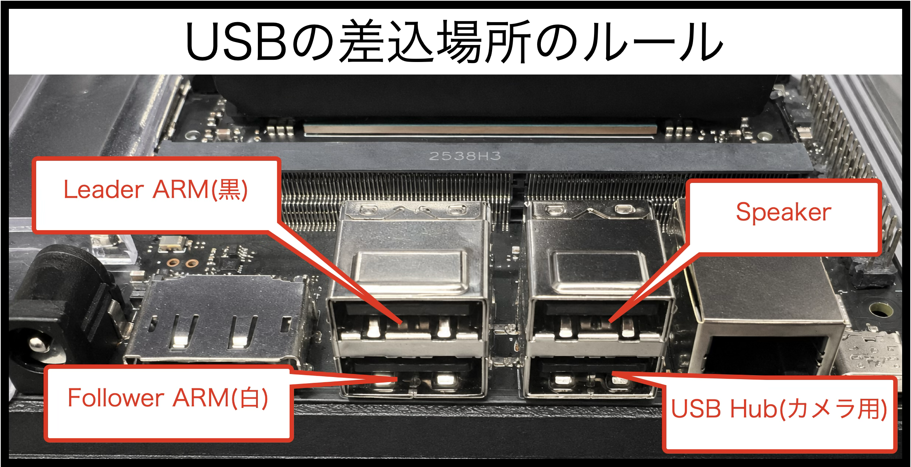

# LeRobot 実習と AWS 連携の通し手順

従来の SO-101 実習（接続確認、キャリブレーション、収集、編集、学習、推論）に、今回の AWS の認証・接続・データ転送・成果回収を組み込んだ手順です。**ロボットとカメラを動かすのは手元の Jetson／Mac、GPU 学習をするのは自分用の EC2** です。

講師の配布データで学習する場合は、収集・送信の工程を飛ばして「6. EC2 でデータを確認する」から進めます。学習を行わない基本コースは、そこまでの情報表示と Rerun 確認で実習を終え、[保存と回収](save.md)へ進んでください。

!!! note "この通し手順の確認範囲"
    AWS の接続、教材取得、データ情報表示、DCV 上の Rerun、小さなファイルの S3 往復は実測済みです。SO-101 の収集・変更編集と EC2 の GPU 学習、学習済みモデルを手元へ戻した実機推論を含む通し実行は未検証です。これらを行うコースでは、講師が同じ機器・データ・EC2 環境で確認してから進めます。[出典と検証範囲](verification.md)も参照してください。

## 全体の流れと実行場所

| 順番 | 作業 | 実行場所 | 完了の目安 |
| --- | --- | --- | --- |
| 1 | AWS の値と受講者ツールを準備 | 手元 | 自分の開催・受講者 ID を確認 |
| 2 | ロボット・カメラ・ポートを確認 | 手元の Jetson／Mac | 機器を検出 |
| 3 | キャリブレーション、テレオペレーション | 手元の Jetson／Mac | Leader に Follower が追従 |
| 4 | 1 回試してからデータを収集 | 手元の Jetson／Mac | 映像とエピソードを確認 |
| 5 | 自分専用の S3 領域へ送信 | 手元の Jetson／Mac | アーカイブとハッシュを保存 |
| 6 | 自分の EC2 へ取得、情報・映像を確認 | EC2 の ubuntu | データの件数・内容を照合 |
| 7 | 必要なら別の場所へ編集結果を出力 | EC2 の ubuntu | 元データを保ち結果を確認 |
| 8 | ACT の学習、必要なら継続 | EC2 の ubuntu | チェックポイントを確認 |
| 9 | チェックポイントを S3 経由で回収 | EC2 → 手元 | ハッシュ一致、モデルを展開 |
| 10 | 学習時と同じ機器で推論 | 手元の Jetson／Mac | 10 秒の動作を確認 |
| 11 | 成果を確認して片付け | 手元 | 成果が手元に残っている |

EC2 に手元の USB ポートやカメラは自動では接続されません。手元の `/dev/tty…` や `/dev/video0` を EC2 のコマンドに指定しないでください。AWS のログインは手元と EC2 で別です。ターミナルを切り替えるときは、見出しの実行場所を確認します。

## 1. AWS の設定と受講者環境を準備する

実行場所: **手元の PC／Jetson／Mac**。使う機器の LeRobot v0.6.0、SO-101、カメラの準備は講師が行います。手元の既存 LeRobot 環境と EC2 の Python 3.12 環境は、それぞれの機器で有効にします。

[各種値の設定](common.md)で、開催 ID、受講者 ID、バケット、リージョン、データセット識別名を入力します。講師から設定 JSON を受け取った場合は「インポート」を使えます。EC2 のデータセットディレクトリは **自分が新しく取得する場所** にします。例は `/home/ubuntu/handson-work/開催ID/受講者ID/datasets/round1` です。講師の配置済みデータを使う場合は、その場所を指定して上書きしません。

手元で収集する場所は、この後の `LOCAL_DATASET_DIR` です。共通設定の `DATASET_DIR` は EC2 の場所なので、同じパスにする必要はありません。`DATASET_REPO_ID` は両方で同じ識別名を使います。

初回は [PC の準備](setup.md)の依存確認を済ませ、講師から受け取った URL と認証情報ファイルで導入します。秘密情報は設定フォームへ入れません。

```bash
curl -fsSL '<導入スクリプトの URL>' -o bootstrap.sh
bash bootstrap.sh --env-file '<認証情報ファイルの絶対パス>'
source ~/gclue-ai-handson/{{EVENT_ID}}/activate
gclue-ai-handson-attendee env info
```

表示された開催 ID・受講者 ID が自分の値と一致し、認証情報の有効期限内であることを確認します。macOS は `fc6e58d` の修正を含む受講者ツールを使います。期限切れ・配布版の確認と更新は [PC の準備](setup.md)を参照してください。

教材を取得します。これは講師の共有教材を読む操作です。

```bash
gclue-ai-handson-attendee files pull --dest ./materials
```

`manifest.json` の SHA-256 確認が成功したら次へ進みます。

## 2. 手元の機器と実習用の値を確認する

実行場所: **ロボットとカメラを接続した Jetson／Mac**。LeRobot を使用できるターミナルで実行します。



```bash
lerobot-find-port
lerobot-find-cameras opencv
```

検出結果に合わせて、手元の作業ディレクトリと Leader／Follower のポートを設定します。`<…>` は手動で置き換えます。以下の手元の工程は、このターミナルで続けて実行します。

```bash
PROJECT_DIR='<LeRobot作業ディレクトリ>'
TELEOP_PORT='<Leaderのポート>'
ROBOT_PORT='<Followerのポート>'
LOCAL_DATASET_DIR="$HOME/handson-data/{{EVENT_ID}}"
LOCAL_DATASET_DIR+="/{{ATTENDEE_ID}}/round1"
DATASET_REPO_ID={{DATASET_REPO_ID_SH}}
TASK='Pick up the red cube'
cd "$PROJECT_DIR"
```

`my_leader_arm` と `my_follower_arm` は、キャリブレーション・収集・推論で同じ機器に同じ ID を使います。タスクの文、カメラの名前 `front`、位置、解像度、FPS も収集と推論で合わせます。

=== "Jetson"

    `/dev/video0`、640×480、MJPG、30 FPS に対応するカメラの例です。検出結果が異なる場合は講師と値を合わせます。SSH で操作する場合は GUI 表示を無効にします。

    ```bash
    CAMERAS="{front: {type: opencv, index_or_path: '/dev/video0',"
    CAMERAS+=" backend: 200, width: 640, height: 480, fps: 30,"
    CAMERAS+=" fourcc: 'MJPG'}}"
    DEVICE=cuda
    DISPLAY_DATA=false
    ```

=== "Mac"

    カメラ番号 `0` の例です。検出された番号を指定し、MJPG は固定しません。デスクトップのターミナルを使います。

    ```bash
    CAMERAS='{front: {type: opencv, index_or_path: 0,'
    CAMERAS+=' width: 640, height: 480, fps: 30}}'
    DEVICE=mps
    DISPLAY_DATA=true
    ```

## 3. キャリブレーションとテレオペレーション

実行場所: **手元の Jetson／Mac**。機器の可動範囲を空け、停止操作ができる状態で進めます。

```bash
lerobot-calibrate \
  --teleop.type=so101_leader \
  --teleop.port="$TELEOP_PORT" \
  --teleop.id=my_leader_arm

lerobot-calibrate \
  --robot.type=so101_follower \
  --robot.port="$ROBOT_PORT" \
  --robot.id=my_follower_arm
```

既存のキャリブレーションをやり直す場合は、質問に `c` を入力し、表示された案内に従います。

```bash
lerobot-teleoperate \
  --robot.type=so101_follower \
  --robot.port="$ROBOT_PORT" \
  --robot.id=my_follower_arm \
  --teleop.type=so101_leader \
  --teleop.port="$TELEOP_PORT" \
  --teleop.id=my_leader_arm
```

Follower が Leader に追従することを確認し、Ctrl+C で終了します。

## 4. カメラを1回試してから収集する

実行場所: **手元の Jetson／Mac**。最初は1エピソード、10秒で映像と動作を確認します。同じ場所に既存データがある場合は削除せず、`round1` を新しい名前へ変えてください。

```bash
lerobot-record \
  --robot.type=so101_follower \
  --robot.port="$ROBOT_PORT" \
  --robot.id=my_follower_arm \
  --teleop.type=so101_leader \
  --teleop.port="$TELEOP_PORT" \
  --teleop.id=my_leader_arm \
  --robot.cameras="$CAMERAS" \
  --dataset.repo_id="$DATASET_REPO_ID" \
  --dataset.root="$LOCAL_DATASET_DIR" \
  --dataset.push_to_hub=false \
  --dataset.single_task="$TASK" \
  --dataset.fps=30 \
  --dataset.episode_time_s=10 \
  --dataset.reset_time_s=5 \
  --dataset.num_episodes=1 \
  --dataset.streaming_encoding=false \
  --display_data="$DISPLAY_DATA"
```

手元のデスクトップでは、次で最初のエピソードを表示できます。SSH のみで作業している場合は、手元のデスクトップを使うか、送信後に EC2 の DCV で確認します。

```bash
lerobot-dataset-viz \
  --repo-id "$DATASET_REPO_ID" \
  --root "$LOCAL_DATASET_DIR" \
  --episode-index 0 \
  --mode local \
  --num-workers 0 \
  --batch-size 1
```

映像・関節の記録とタスクが合っていれば、同じ `lerobot-record` コマンドの `--dataset.num_episodes=1` を `29` に変更し、末尾へ `--resume=true` を追加して29エピソードを追加します。合計は30です。追加時も保存場所、識別名、カメラ構成、FPS、タスクは変えません。

## 5. 収集したデータを自分用の S3 領域へ送る

実行場所: **手元の Jetson／Mac**。受講者ツールを有効にしたターミナルで実行します。S3 の `shared/` は共有教材用です。自分の収集データは自分専用の領域へ保存します。

```bash
TRANSFER_DIR=$(mktemp -d)
tar -czf "$TRANSFER_DIR/dataset.tar.gz" \
  -C "$LOCAL_DATASET_DIR" .
shasum -a 256 "$TRANSFER_DIR/dataset.tar.gz"
gclue-ai-handson-attendee files upload \
  "$TRANSFER_DIR/dataset.tar.gz" --to datasets/round1
```

表示された64桁の SHA-256 を控えます。アーカイブにはデータセットの中身を直接入れているので、展開後の場所に `meta/info.json` が来ます。`datasets/round1` はこの受講者の領域内の転送先です。次の収集分では `round2` など別の転送先を使い、取得側のパスも合わせます。

## 6. EC2 へ取得し、データと映像を確認する

### 6.1 EC2 の ubuntu ユーザーへ接続する

実行場所: **手元の PC**。初回は [接続手順](connect.md)で DCV のパスワードを設定します。

```bash
gclue-ai-handson-attendee dcv
```

トンネル用のターミナルは開いたまま、案内された URL から DCV にログインします。DCV デスクトップ内で Terminal を開き、以降の EC2 工程はそこで実行します。情報表示や学習だけなら `gclue-ai-handson-attendee ssh` でも接続できます。

### 6.2 EC2 の作業環境と認証を確認する

実行場所: **EC2 の ubuntu**。講師が LeRobot と受講者用の一時認証情報を配置済みであることが前提です。

```bash
whoami
cd ~/lerobot
uv run --no-sync python --version
uv run --no-sync lerobot-train --help
source /tmp/gclue-ai-handson-{{EVENT_ID}}-{{ATTENDEE_ID}}.env
DATASET_DIR={{DATASET_DIR_SH}}
DATASET_REPO_ID={{DATASET_REPO_ID_SH}}
S3_ROOT="s3://$GCLUE_AI_HANDSON_BUCKET"
S3_ROOT+="/$GCLUE_AI_HANDSON_ATTENDEE"
```

`whoami` が `ubuntu` であることを確認します。認証情報がない・期限切れの場合は講師に再配布を依頼します。EC2 上で依存を追加・更新せず、環境の不足は講師に確認します。

### 6.3 自分の収集データを取得する

講師の配置済みデータを使う場合は、この取得・展開を飛ばして次の情報表示へ進みます。

```bash
DOWNLOAD_DIR=$(mktemp -d)
aws s3 cp "$S3_ROOT/datasets/round1/dataset.tar.gz" \
  "$DOWNLOAD_DIR/dataset.tar.gz"
sha256sum "$DOWNLOAD_DIR/dataset.tar.gz"
```

手元で控えた SHA-256 と一致することを確認してから、**まだ存在しない取得先**へ展開します。

```bash
(
  set -e
  test ! -e "$DATASET_DIR" || {
    echo '取得先が存在します。別のパスを指定してください。' >&2
    exit 1
  }
  mkdir -p "$DATASET_DIR"
  tar -xzf "$DOWNLOAD_DIR/dataset.tar.gz" -C "$DATASET_DIR"
  test -f "$DATASET_DIR/meta/info.json"
)
```

### 6.4 情報と映像を確認する

```bash
uv run --no-sync lerobot-edit-dataset \
  --repo_id "$DATASET_REPO_ID" \
  --root "$DATASET_DIR" \
  --operation.type info
```

エピソード数、フレーム数、FPS、タスクを収集時の記録と照合します。DCV の Terminal では、次で Rerun を表示します。

```bash
uv run --no-sync rerun "$DATASET_DIR"
```

失敗したエピソード番号を控えます。配布データが Git LFS のポインタのままの場合は、[データ確認](dataset.md)の復旧手順を使います。

## 7. 必要な場合だけ、別の場所へ編集結果を出力する

実行場所: **EC2 の ubuntu**。失敗したエピソードを除く場合の例です。`[1, 2]` は確認した番号へ置き換えます。変更編集は今回の EC2 実測対象外です。

```bash
CLEAN_DATASET_DIR="${DATASET_DIR}_clean"
export HF_HUB_OFFLINE=1
uv run --no-sync lerobot-edit-dataset \
  --repo_id "$DATASET_REPO_ID" \
  --root "$DATASET_DIR" \
  --new_repo_id "${DATASET_REPO_ID}_clean" \
  --new_root "$CLEAN_DATASET_DIR" \
  --operation.type delete_episodes \
  --operation.episode_indices '[1, 2]'
```

元データの場所は変えず、結果を新しい場所へ出力します。出力先が既にある場合は削除せず、別の名前にします。編集後は `info` と映像で件数・内容を確認し、確認できてから学習用の値を切り替えます。

```bash
DATASET_DIR="$CLEAN_DATASET_DIR"
DATASET_REPO_ID="${DATASET_REPO_ID}_clean"
```

編集をしない場合は、この値の切替も飛ばします。共通設定は自動更新されないので、別の Terminal で再開する場合は編集後の場所・識別名を設定し直します。

## 8. EC2 で ACT を学習する

実行場所: **EC2 の ubuntu**。講師が CUDA と GPU 計算、ACT の ResNet18 重みのキャッシュを確認済みの場合に進めます。今回の AWS 実測では GPU 学習は未検証です。Jetson 用のメモリ設定や Mac の `mps` を EC2 へそのまま移しません。

```bash
nvidia-smi
uv run --no-sync python - <<'PY'
import torch
print(torch.__version__, torch.cuda.is_available())
PY
```

GPU が表示され、`torch.cuda.is_available()` が `True` なら、まず5000ステップで確認します。出力先は実行日時付きで作り、過去の成果を削除しません。

```bash
RUN_NAME="act-$(date +%Y%m%d-%H%M%S)"
TRAIN_OUTPUT_DIR="$HOME/handson-work/{{EVENT_ID}}"
TRAIN_OUTPUT_DIR+="/{{ATTENDEE_ID}}/outputs/$RUN_NAME"
export HF_HUB_OFFLINE=1
uv run --no-sync lerobot-train \
  --dataset.root="$DATASET_DIR" \
  --dataset.repo_id="$DATASET_REPO_ID" \
  --dataset.video_backend=pyav \
  --policy.type=act \
  --output_dir="$TRAIN_OUTPUT_DIR" \
  --job_name="$RUN_NAME" \
  --policy.device=cuda \
  --policy.push_to_hub=false \
  --save_checkpoint_to_hub=false \
  --wandb.enable=false \
  --steps=5000 \
  --save_freq=5000 \
  --batch_size=2 \
  --num_workers=0 \
  --policy.use_amp=true \
  --policy.use_vae=false \
  --policy.chunk_size=50 \
  --policy.n_action_steps=50
```

学習ログの終了とチェックポイントを確認します。5000ステップだけでタスクが成功するとは限りません。必要なら講師と総ステップ数を決め、同じ出力を使って継続します。

```bash
TRAIN_CONFIG_PATH="$TRAIN_OUTPUT_DIR/checkpoints/last"
TRAIN_CONFIG_PATH+="/pretrained_model/train_config.json"
uv run --no-sync lerobot-train \
  --config_path="$TRAIN_CONFIG_PATH" \
  --resume=true \
  --steps=15000 \
  --policy.push_to_hub=false \
  --save_checkpoint_to_hub=false \
  --wandb.enable=false
```

`steps=15000` は追加15000回ではなく、継続後の総ステップ数です。実際にできた `train_config.json` の場所を確認して指定します。`RUN_NAME` と `TRAIN_OUTPUT_DIR` を控え、以降もこの EC2 の Terminal で続けます。

## 9. チェックポイントを S3 経由で手元へ回収する

### 9.1 EC2 から保存する

実行場所: **EC2 の ubuntu**。前の学習で使った `RUN_NAME` と `TRAIN_OUTPUT_DIR` を使います。学習が正常に終了したことを確認してから進めます。

```bash
source /tmp/gclue-ai-handson-{{EVENT_ID}}-{{ATTENDEE_ID}}.env
S3_ROOT="s3://$GCLUE_AI_HANDSON_BUCKET"
S3_ROOT+="/$GCLUE_AI_HANDSON_ATTENDEE"
EXPORT_DIR=$(mktemp -d)
tar -czf "$EXPORT_DIR/checkpoints.tar.gz" \
  -C "$TRAIN_OUTPUT_DIR" checkpoints
sha256sum "$EXPORT_DIR/checkpoints.tar.gz"
aws s3 cp "$EXPORT_DIR/checkpoints.tar.gz" \
  "$S3_ROOT/models/$RUN_NAME/checkpoints.tar.gz"
printf '学習実行名: %s\n' "$RUN_NAME"
```

表示された学習実行名と SHA-256 を控えます。自分専用の `models/学習実行名/` に保存されます。認証切れなら更新後に保存し直します。

### 9.2 手元へ取得し、内容を確認する

実行場所: **手元の Jetson／Mac**。受講者ツールを有効にし、`<学習実行名>` を EC2 で控えた値に置き換えます。

```bash
RUN_NAME='<学習実行名>'
RECOVER_DIR=$(mktemp -d)
gclue-ai-handson-attendee files pull --own \
  --prefix "models/$RUN_NAME" --dest "$RECOVER_DIR"
shasum -a 256 "$RECOVER_DIR/checkpoints.tar.gz"
```

EC2 で控えた SHA-256 と一致したら、新しいモデル保存先へ展開します。

```bash
LOCAL_MODEL_DIR="$HOME/handson-models/$RUN_NAME"
(
  set -e
  test ! -e "$LOCAL_MODEL_DIR" || {
    echo 'モデル保存先が存在します。別のパスを使ってください。' >&2
    exit 1
  }
  mkdir -p "$LOCAL_MODEL_DIR"
  tar -xzf "$RECOVER_DIR/checkpoints.tar.gz" -C "$LOCAL_MODEL_DIR"
)
POLICY_PATH="$LOCAL_MODEL_DIR/checkpoints/last/pretrained_model"
```

`checkpoints/last` がアーカイブ内の別のチェックポイントへのリンクである場合も、そのリンク先を含む `checkpoints` 全体を回収します。次で設定とモデルファイルを確認します。

```bash
test -f "$POLICY_PATH/config.json"
find "$POLICY_PATH" -maxdepth 1 -type f \
  -name '*.safetensors' -print
```

両方を確認できなければ推論へ進まず、実際のチェックポイントの場所を講師と確認します。画像のキーや関節構成も、収集時と同じ機器構成に合わせます。

## 10. 手元のロボットで10秒だけ推論する

実行場所: **手元の Jetson／Mac**。2〜4で設定したポート、カメラ、タスクと、9で回収した `POLICY_PATH` を使います。新しい Terminal ではそれらの値を設定し直します。

ロボット周囲の障害物を除き、カメラ位置、照明、物体、背景、初期姿勢を収集時に合わせます。いつでも Ctrl+C で停止できる状態で、最初は録画をせず10秒だけ確認します。この AWS 連携後の実機推論は未検証です。

```bash
cd "$PROJECT_DIR"
export HF_HUB_OFFLINE=1
lerobot-rollout \
  --strategy.type=base \
  --policy.path="$POLICY_PATH" \
  --robot.type=so101_follower \
  --robot.port="$ROBOT_PORT" \
  --robot.id=my_follower_arm \
  --robot.cameras="$CAMERAS" \
  --device="$DEVICE" \
  --fps=30 \
  --duration=10 \
  --task="$TASK" \
  --display_data="$DISPLAY_DATA" \
  --return_to_initial_position=true
```

推論中に意図しない動きがあれば停止し、キャリブレーション、カメラとタスク、回収したモデルの組合せを確認します。`base` は録画しない方式なので `--dataset.*` は付けません。

## 11. 成果を確認して片付ける

手元の収集データ、回収したチェックポイント、ハッシュ、実行名、実習結果が残っていることを確認してから、DCV／SSH の接続を閉じます。[終了時の片付け](finish.md)で一時認証情報と講習会用の環境を片付けます。EC2 の停止・削除は講師・構築担当者へ依頼します。

## このページの出典

従来の `docs/lerobot/check.md`、`calibration.md`、`camera.md`、`collect.md`、`edit.md`、`train.md`、`run.md` を、[今回の AWS ガイドの出典](verification.md)の導入・接続・保存契約に合わせて統合しました。収集と推論は手元、学習とデータ確認は EC2 とし、従来の Jetson 向け学習時間を EC2 の実績としては扱いません。

CLI の役割は [公式のロボット学習手順](https://huggingface.co/docs/lerobot/il_robots)、固定版の引数は [LeRobot v0.6.0 の学習設定](https://github.com/huggingface/lerobot/blob/v0.6.0/src/lerobot/configs/train.py)と [推論 CLI](https://github.com/huggingface/lerobot/blob/v0.6.0/src/lerobot/scripts/lerobot_rollout.py)も参照しています。文書・構文・ローカルのサンプル確認と、AWS／ロボット実機の通し実行は区別します。
